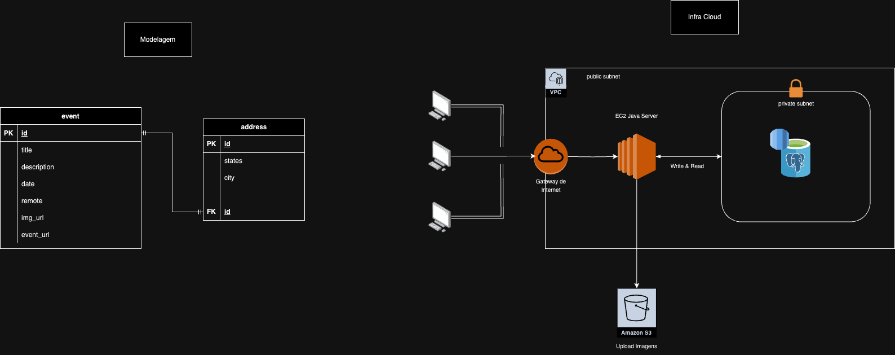

# Mobato Guide Events

## Visão Geral

Este projeto faz parte da infraestrutura de eventos do Mobato Guide. A aplicação é projetada para gerenciar eventos, armazenar endereços associados e fornecer acesso seguro aos dados através de uma infraestrutura em nuvem.

## Arquitetura

A arquitetura do sistema é dividida em duas partes principais: a **Modelagem** dos dados e a **Infraestrutura em Nuvem**.

### Modelagem dos Dados

A modelagem dos dados é baseada em duas tabelas principais:

- **Tabela `event`**:
    - `id` (PK): Identificador único do evento.
    - `title`: Título do evento.
    - `description`: Descrição do evento.
    - `date`: Data do evento.
    - `remote`: Indicador se o evento é remoto ou presencial.
    - `img_url`: URL da imagem associada ao evento.
    - `event_url`: URL do evento.

- **Tabela `address`**:
    - `id` (PK): Identificador único do endereço.
    - `states`: Estado do endereço.
    - `city`: Cidade do endereço.
    - `id` (FK): Chave estrangeira referenciando a tabela `event`.

### Infraestrutura em Nuvem

A infraestrutura é composta por componentes na AWS:

- **VPC (Virtual Private Cloud)**: Rede privada virtual para isolar a infraestrutura.
- **Internet Gateway**: Ponto de entrada e saída para a VPC, permitindo a comunicação com a Internet.
- **EC2 Java Server**: Servidor Java hospedado em uma instância EC2 para processar requisições.
- **Amazon RDS (PostgreSQL)**: Banco de dados relacional para armazenar os dados dos eventos e endereços. Está localizado em uma sub-rede privada para maior segurança.
- **Amazon S3**: Serviço de armazenamento para upload e armazenamento de imagens associadas aos eventos.

### Fluxo de Dados

1. Usuários fazem requisições através da Internet, que são direcionadas ao **Internet Gateway**.
2. O **Internet Gateway** encaminha as requisições para o **EC2 Java Server** dentro da sub-rede pública da VPC.
3. O **EC2 Java Server** processa as requisições e interage com o banco de dados **PostgreSQL** no **Amazon RDS** para ler e gravar dados.
4. Imagens dos eventos são carregadas e armazenadas no **Amazon S3**.

## Configuração

### Pré-requisitos

- Conta AWS com permissões para criar instâncias EC2, buckets S3 e instâncias RDS.
- Ambiente Java configurado para desenvolvimento do servidor.

### Passos de Configuração

1. **Configurar VPC e Sub-redes**:
    - Crie uma VPC e configure sub-redes públicas e privadas.
    - Adicione um Internet Gateway à VPC.

2. **Deploy do EC2 Java Server**:
    - Lançar uma instância EC2 com configuração adequada.
    - Deploy do servidor Java na instância EC2.

3. **Configurar Amazon RDS**:
    - Crie uma instância RDS com PostgreSQL dentro da sub-rede privada da VPC.
    - Configure as tabelas `event` e `address` conforme a modelagem apresentada.

4. **Configurar Amazon S3**:
    - Crie um bucket S3 para armazenar as imagens dos eventos.
    - Configure políticas de acesso apropriadas para o bucket.

## Uso

- Os usuários podem interagir com o sistema através da interface fornecida, que faz requisições ao servidor Java hospedado no EC2.
- O servidor Java manipula os dados de eventos e endereços no banco de dados PostgreSQL e gerencia o upload de imagens para o S3.

## Contribuição

Para contribuir com o projeto, siga os passos abaixo:

1. Faça um fork do repositório.
2. Crie uma branch para suas alterações (`git checkout -b feature/nome-da-feature`).
3. Commit suas alterações (`git commit -am 'Adiciona nova feature'`).
4. Faça push para a branch (`git push origin feature/nome-da-feature`).
5. Abra um Pull Request.

## Licença

Este projeto está licenciado sob os termos da licença MIT. Veja o arquivo [LICENSE](LICENSE) para mais detalhes.
